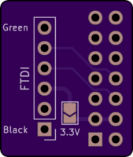
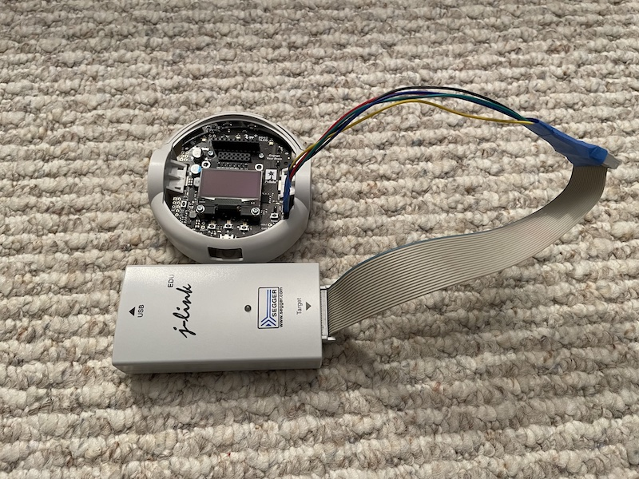

<br>
My experiments with [Pololu's 3pi+ 2040 robot kit](https://www.pololu.com/product/5004) that was [released on March 7th, 2023](https://www.pololu.com/blog/937/introducing-the-3pi-plus-2040-robot).


## Notable Page Sections
* [Using Arduino with the 3pi+ 2040](#arduino--3pi-2040)
* [My 3pi+ 2040 Arduino Library](#pololu3piplus2040-arduino-library-port-completed)
* [Debugging 3pi+ 2040 with the Segger J-Link](#debugging-the-3pi-with-segger-j-link)
* [My Notes for Pololu](#my-notes-for-pololu)


## Pololu Links
* [3pi+ 2040 Robot Kit with 30:1 MP Motors (Standard Edition Kit) Pololu Product Page](https://www.pololu.com/product/5004)
* [Pololu 3pi+ 2040 User’s Guide](https://www.pololu.com/docs/0J86)
* [Pololu 3pi+ 2040 Robot Libraries and Example Code on GitHub](https://github.com/pololu/pololu-3pi-2040-robot)


---
## June 6th, 2023
### MRI-SWD Debug Probe Progress
It's been awhile since I had anything to post here but that doesn't mean that I haven't been making progress on a 3π+ 2040 related project. I have spent the last month working on my [MRI-SWD Debug probe](https://github.com/adamgreen/mri-swd#readme). The goal is to use this probe to wirelessly program and debug the RP2040 microcontroller on the 3π+ 2040 robot.

I have the initial prototype far enough along that it can perform basic programming and debugging of RP2040 microcontrollers but only in a breadboard setup. The following shows a sample run of GDB using the programming functionality of the debug probe as it currently exists:

```console
$ arm-none-eabi-gdb -ex "set target-charset ASCII" -ex "set print pretty on" -ex "set remotelogfile mri.log" -ex "target remote 10.0.0.12:2331" -ex "set mem inaccessible-by-default off" test.elf

GNU gdb (Arm GNU Toolchain 12.2 (Build arm-12-mpacbti.34)) 13.1.90.20230307-git
Copyright (C) 2023 Free Software Foundation, Inc.
License GPLv3+: GNU GPL version 3 or later <http://gnu.org/licenses/gpl.html>
This is free software: you are free to change and redistribute it.
There is NO WARRANTY, to the extent permitted by law.
Type "show copying" and "show warranty" for details.
This GDB was configured as "--host=aarch64-apple-darwin20.6.0 --target=arm-none-eabi".
Type "show configuration" for configuration details.
For bug reporting instructions, please see:
<https://bugs.linaro.org/>.
Find the GDB manual and other documentation resources online at:
    <http://www.gnu.org/software/gdb/documentation/>.

For help, type "help".
Type "apropos word" to search for commands related to "word"...
Reading symbols from build/QuadratureDecoder.elf...
Remote debugging using 10.0.0.12:2331
get_absolute_time () at /depots/QuadratureDecoder/pico-sdk/src/common/pico_time/include/pico/time.h:63
63	    update_us_since_boot(&t, time_us_64());
(gdb) load
Loading section .boot2, size 0x100 lma 0x10000000
Loading section .text, size 0x7130 lma 0x10000100
Loading section .rodata, size 0x17c8 lma 0x10007230
Loading section .binary_info, size 0x1c lma 0x100089f8
Loading section .data, size 0x2dc lma 0x10008a14
Start address 0x100001e8, load size 36080
Transfer rate: 47 KB/sec, 5154 bytes/write.
```

### UART Port Adapter


Now that I have the **mri-swd** probe working in a breadboard setup, I want to start down the path of designing PCBs which will allow the debug probe to be attached easily to the 3π+ 2040 robot itself. With that in mind, I have started designing a PCB that attaches to the **Mid Expansion Header** on the 3π+ 2040:
* This PCB routes the UART0 Rx, UART0 Tx, and Ground lines from the 3π+ header to a 6-pin 0.1" header which is compatible with FTDI USB to serial converters, such as this [one from Adafruit](https://www.adafruit.com/product/284).
* This PCB also optionally allows the 3.3V power line of the 3π+ 2040 robot to be connected to the 6-pin FTDI compatible header. Normally this connection isn't needed as the robot will be powered from its own batteries or USB:
  * If used with an actual FTDI adapter then the 3.3V solder jumper on the PCB should be left open circuit so that both the robot and the FTDI adapter don't try to both apply power to the same pin.
  * I also plan to use this 6-pin header for powering and mounting the final **mri-swd** debug probe hardware to the robot. When used for this scenario, the 3.3V solder jumper should be shorted so that the robot's power supply can be used to power the debug hardware as well. Having the **mri-swd** debug probe connected to this header will also allow the probe to expose the UART0 serial traffic on a second WiFi socket.
* The design has been sent off to [OSHPark](https://oshpark.com). I will post again once the PCB arrives and I have it soldered up.


---
## April 22nd, 2023


I received the PCBs from [OSHPark](https://oshpark.com) for my [Debug Port Adapter](hardware/DebugPortAdapter/) this week. A day later I soldered one of them up and now I have a much easier way to connect the [Segger J-Link Debugger](https://www.adafruit.com/product/1369) to my 3π+ 2040. As can be seen above it contains:
* A 10-pin connector that can accept standard SWD debug cables.
* A reset button which is easier to access than the original now under this adapter.
* A power LED which is easier to see than the original now under this adapter.


---
## April 12th, 2023
### Pololu3piPlus2040 Arduino Library Updated to 0.1.2
Over the last week, I have released another 2 updates to the [3π+ 2040 Arduino Library](https://github.com/adamgreen/pololu-3pi-plus-2040-arduino-library). These updates include the following changes:
* 0.1.2 (2023-4-8): Third alpha release from community with a few updates:
  * Moved `Pololu3piPlus2040::BumpSensors::BumpSide` up in namespace to `Pololu3piPlus2040::BumpSide`.
  * Simplify `LineSensors` API to remove `sensorValues` out parameter.
  * Added `RGBLEDs::get()` and `RGBLEDs::getBrightness()` methods to match recent MicroPython library updates.
  * Simplified and fixed a few bugs in my C implementation of the `RGBLEDs::hsv2rgb()` method.
  * Fix buzzer click upon device reset.
  * Fixes to `BumpSensors` class constructor and documentation for `read()` method.
* 0.1.1 (2023-4-4): Second alpha release from community with Motor & Buzzer PWM fixes.

### Start of Pololu3piPlus2040 Arduino Library version 0.2.x
I have started working on a [0.2.x branch](https://github.com/adamgreen/pololu-3pi-plus-2040-arduino-library/tree/v0.2.x) of the 3π+ 2040 Arduino Library. This branch is an attempt to start leveraging [Pololu's Pico-SDK based C library for the 3π+ 2040 robot](https://github.com/pololu/pololu-3pi-2040-robot/tree/master/c). This should allow the Arduino Library to just become a lightweight C++ inline wrapper around this C API developed by Pololu.

### My 3π+ 2040 Bot has a Littermate
<br>
I received a second [3π+ 2040 Robot Kit](https://www.pololu.com/product/5004) today. This kit was purchased with the early adopters discount from Pololu described below in a quote from the 3π+ 2040 product page:

>Early adopters who publicly share their 3pi+ 2040 experiences will be eligible for an additional robot with an extra $25 discount.

### Next Steps
* Attempt to design a wireless debugging/programming solution for the 3π+ 2040 robot.


---
## April 6th, 2023
### Debug Port Adapter


My current method of connecting the J-Link debugger to my 3pi+ 2040 is a bit hacky with taped together Dupont wires. Can I make something a bit better?


My answer to that question was to design an [adapter PCB in KiCAD](hardware/DebugPortAdapter/) that makes the J-Link connection easier:
* Adapts the 6-pin debug header included by Pololu on the 3pi+ 2040 to the more standard 2x5 pin SWD debug connector.
* This PCB will obscure the green power LED currently on the robot so I have included a LED that lights up when the 3.3V pin on th header is powered up.
* This PCB also makes it even more difficult to reach the reset button on the robot so I have included a reset button as well.
* I plan to design a part to be 3D printed and glued to the back of this PCB to add some support behind the SWD connector and the reset button.
* The design has been sent off to [OSHPark](https://oshpark.com). I will post again once the PCB arrives and I have it soldered up.


---
## April 5th, 2023
### Pololu3piPlus2040 Arduino Library Port Completed


I have completed the initial port of my [3pi+ 2040 Arduino Library](https://github.com/adamgreen/pololu-3pi-plus-2040-arduino-library). All of the features of the 3pi+ 2040 are now supported by the library and test out well on my bot.

**Features that I completed since my last update here:**
* **Buttons** - Had to take into account that all of the button pins do double duty so code had to be written to carefully multiplex between these pin roles.
* **Encoders** - Used PIO for the RP2040 port like Pololu did in their MicroPython library. Rather than port the PIO code from the MicroPython library, I just used my existing [QuadratureDecoder code](https://github.com/adamgreen/quadraturedecoder)
* **IMU** - The Gyro/Accelerometer used on the 3pi+ 2040 has a different part number than the 3pi+ 32U4 but the only difference I found was the response to the I2C WHO_AM_I request.
* **Line Sensors** - Most of the work for this was already done for the PIO based bump sensor driver.
* **Motors**

The list of supported classes now includes:
* Pololu3piPlus2040::ButtonA
* Pololu3piPlus2040::ButtonB
* Pololu3piPlus2040::ButtonC
* Pololu3piPlus2040::Buzzer
* Pololu3piPlus2040::Encoders
* Pololu3piPlus2040::OLED
* Pololu3piPlus2040::Motors
* Pololu3piPlus2040::LineSensors
* Pololu3piPlus2040::BumpSensors
* Pololu3piPlus2040::IMU
* Pololu3piPlus2040::RGBLEDs
* Pololu3piPlus2040::ledYellow()
* Pololu3piPlus2040::readBatteryMillivolts()


---
## March 31st, 2023
### Arduino & 3pi+ 2040


The latest Arduino IDE already ships with a board package that is compatible with the 3pi+ 2040: **Arduino Mbed OS RP2040 Boards**. The circuit of the 3pi+ 2040 PCB is close enough to the Raspberry Pi Pico that it just worked:
* The **W25Q128JVP**  16MB flash part used on the 3pi+ 2040 PCB seems to be similar enough to the **W25Q16JVUXIQ** 2MB flash part used on the Pico that the second stage bootloader linked into Arduino binaries just work. *If someone knows that I should be using a different second stage bootloader with this device, please let me know.*
* The yellow LED on the 3pi+ 2040 is even connected to the same pin as the user LED on the Pico, **Pin 25**. This means that the stock **Blink** Arduino example just worked on the 3pi+ 2040 as well.


### Uploading Code from Arduino IDE to 3pi+ 2040
The Arduino IDE was able to successfully upload new code to the 3pi+ 2040 over the same USB connection as used for MicroPython programming. There are 2 ways that the Arduino IDE can upload code to the RP2040 microcontroller using the USB cable:
* Once you have Arduino code up and running on your RP2040, the IDE can use USB to make a serial connection to the device. This means that `Serial.print()` calls in your code will show up in Arduino's *Serial Monitor*. Arduino can use this same USB serial connection to place the RP2040 into bootloader mode automatically. The user just needs to select the **Sketch/Upload** option in the Arduino IDE and it will build and deploy the code to your 3pi+ 2040 robot with no manual intervention from you. The image below shows the 3pi+ 2040 robot showing up as a **Rasperry Pi Pico** on the **dev/cu.usbmodem1101** virtual serial port when connected to my Mac.

* The previous automatic upload process doesn't always work though. If the Arduino USB serial driver isn't successfully running on your 3pi+ 2040 then you will need to place the RP2040 into bootloader mode manually before starting the upload process in Arduino.All you need to do is hold down the **B Button** while cycling the **Reset Button**. This will force the RP2040 into bootloader mode where it shows up on your PC as a **RPI-RP2** drive. Once this special drive shows up on your PC, you can just select the **Sketch/Upload** option in the Arduino IDE as usual. When is this slightly more manual process required?
  * If your 3pi+ 2040 robot is currently running MicroPython. The Arduino USB serial driver isn't running on your bot so it can't be used. **Note:** *Switching to Arduino code from MicroPython will delete your custom MicroPython programs from the 3pi+ 2040. Make backup copies of your MicroPython code before uploading Arduino code to the robot.*
  * If your Arduino robot code hangs so bad that the Arduino USB serial driver can't run on the robot.

If you want to switch back to MicroPython after experimenting with Arduino on your 3pi+ 2040 then you can follow the steps in the [Pololu 3pi+2 2040 User's Guide](https://www.pololu.com/docs/0J86/5.1) to reupload the MicroPython firmware.

### Porting the Pololu3piPlus32U4 Arduino Library


Once I knew that Arduino was going to be relatively easy to use with the 3pi+ 2040, I turned my attention to [Pololu's existing Arduino Library for the ATmega32U4 based 3pi+](https://github.com/pololu/pololu-3pi-plus-32u4-arduino-library). What would it take to start porting this library to run on the 2040 based board instead? It turns out not much and quite a bit at the same time. A lot of the functionality that you would want to expose from a library is the same between the two versions. The biggest obstacle was AVR specific code that was written for the library to get the most performance possible on the 32U4 based board:
* The FastGPIO library is used a lot in the 32U4 library. I replaced this with a RP2040SIO library instead. It takes the methods exposed by Pololu's FastGPIO library and implements them using the RP2040's fast SIO registers instead.
* I came across several places in the 32U4 code which contained inline AVR assembly language. I removed this code and replaced it with corresponding C/C++ code which is probably fast enough on a 125MHz 32-bit ARM Cortex-M0 core.
* The OLED driver was written to use the FastGPIO library and bit twiddling to implement the required SPI protocol rather than the SPI peripheral itself. I created a RP2040SPI library that exposes a SharedSPI class. This SharedSPI class makes use of the SPI peripheral on the RP2040 but is able to switch the SCLK and baud rates on the fly when switching between sending data to the OLED and the addressable RGB LEDs. This is functionality I stole from Pololu's 3pi+ 2040 MicroPython library as it does the same.
* The buzzer code was tied very tightly to the Timer hardware on the AVR. In my RP2040 port, I just used the existing **mbed::Timeout** and **mbed::PWM** C++ objects available from the Arduino mbed core for ARM microcontrollers.

Other changes I made as part of the port so far:
* I modified some of the samples to make use of the addressable LEDs since the RP2040 version of the 3pi+ doesn't have the red and green LEDs of the 32U4 version but it does have six addressable LEDs instead.
* I rewrote the light sensor reading code to use the really cool PIO (Programmable I/O) peripheral on the RP2040 as used by Pololu's MicroPython driver as well. I actually ported Pololu's PIO code and integrated it into a C++ based driver. I did track down a bug in the MicroPython driver and fixed it while working on this port:
  * Originally the Pololu code would have the PIO code start the charging phase at the end of the previous read.
  * The CPU was responsible for kicking off the next read by the PIO.
  * The PIO would then start the discharge phase and start timing the discharge for each light sensor pin.
  * Depending on what the CPU was used to do after the previous read completed and before starting the next read, the capacitors may have ended up with a different level of charge and this would impact the time it took to discharge.
  * The PIO code should be responsible for the timing of the charging phase as well the discharging phase or the readings can be inconsistent.
* The Arduino IDE isn't able to assemble PIO assembly language sources. I have checked in the **.pio** source code and the **.pio.h** header files generated by **pioasm**. This way the pre-assembled output can be used by the Arduino process while the originals are still available in the tree as well. I have a Makefile in the `pio\` folder which can be used to install the Pico C SDK and assemble the PIO assembly language source files. This may only work on macOS though.

At this point I only have a portion of the library ported but I thought I would commit what I have so far to my [3pi+ 2040 Arduino Library GitHub Repository](https://github.com/adamgreen/pololu-3pi-plus-2040-arduino-library) so that I can share my current progress and solicit some feedback.

**Features/Examples that have been ported so far:**
* Only 2 examples have been ported so far: **BlinkLEDs** and **BumpSensorTest**.
* **OLED Display** driver.
* LED driver. This includes the **Yellow LED** shared with the 32U4 version and the 6 addressable **RGB LEDs** that are new for the 2040 version.
* **Bump Sensor** driver.
* **Buzzer** driver.

**Features to be ported in the near future:**
* **Buttons**
* **Encoders** - Will use PIO for the RP2040 port like Pololu did in their MicroPython library.
* **IMU**
* **Line Sensors** - Most of the work for this has already been done for the PIO based bump sensor driver.
* **Motors**

I also created a [PR in the Pololu 3pi+ 2040 repository](https://github.com/pololu/pololu-3pi-2040-robot/pull/1) with my proposed change to the PIO code for the QTR read path.


### Debugging the 3pi+ with Segger J-Link


I didn't get that far into the Arduino library porting before I hit an issue that I really wanted to debug. I have a wireless debugging solution as a future project in mind for the 3pi+ 2040 but that is the future and I had some debugging that I wanted to do right now. Time to pull out my trusty [Segger J-Link Debugger](https://www.adafruit.com/product/1369) and wire it up to my robot. I had previously soldered a 1x6 0.1" header onto the 3pi+'s debug port while putting the kit together. I just needed to use 5 male to male Dupont wires to connect up the necessary signals between the robot and the debug adapter. The end product wasn't pretty but it worked. My drawing below might make the required wiring a bit clearer.

<br>
**Image Portion Credits:**
* [3pi+ Pinout from Pololu's 3pi+ 2040 Control Board Pinout and Peripherals](https://www.pololu.com/file/0J1941/3pi-2040-control-board-pinout.pdf)
* [Legacy JTAG Pinout from ARM's Cortex-M Debug Connectors](https://documentation-service.arm.com/static/5fce6c49e167456a35b36af1)


The command line I used to start the Segger J-Link GDBServer up on my MacBook Air for debugging the RP2040 microcontroller on the robot:
```console
JLinkGDBServer -device RP2040_M0_0 -nohalt -endian little -if SWD -speed 12000 -localhostonly
```

The comand line I use to launch GDB to connect to the J-Link GDBServer and debug the Arduino built binary:
```console
arm-none-eabi-gdb -ex "set target-charset ASCII" -ex "set print pretty on" -ex "target remote :2331" -ex "set mem inaccessible-by-default off" *.ino.elf
```
I run the above command line in the build output directory used by the Arduino build IDE. This directory can be found in the Arduino Output window after a build if the "Show verbose output during:" "compile" box has been checked.

The version of the Segger J-Link debugger that I used is no longer sold by Adafruit but you can still buy the [SEGGER J-Link EDU Mini - JTAG/SWD Debugger](https://www.adafruit.com/product/3571) and it works just as well. *It must be noted that these EDU versions are to be used for **non-commercial** purposes only.*

### Next Steps
* ~~Finish my [3pi+ 2040 Arduino Library port](https://github.com/adamgreen/pololu-3pi-plus-2040-arduino-library).~~
* ~~Use KiCAD to design a PCB that adapts the 3pi+ 2040 debug port to ARM's standard 10-pin SWD connector. This will allow me to get rid of my current cabling hack.~~


---
## March 27th, 2023
### Behavior Based Robot Code in MicroPython


Now that I am more comfortable with using [Pololu's MicroPython library](https://github.com/pololu/pololu-3pi-2040-robot/tree/master/micropython_demo) for programming the 3pi+ 2040 robot, I decided I would take the plunge and port some of the behavior based robot code from ["Mobile Robots: Inspiration to Implementation" by Joseph L. Jones and Anita M. Flynn](https://www.amazon.com/Mobile-Robots-Inspiration-Implementation-Second/dp/B0087P7X2S). I ended up porting the **Cruise** and **Escape** behaviors but I had to skip the **Follow** and **Avoid** behaviors since the 3pi+ robot doesn't have photoresistor or IR proximity sensors. The RugWarrior code from the book was written in IC (Interactive C) which supports multiple processes (threads) for running the various behaviors at the same time. For my MicroPython code I ended up implementing the behaviors as state machines and updating them at regular intervals (50Hz). The state machine doesn't really need to do anything for the **Cruise** behavior since it just wants to keep driving forward at a slow rate. The **Escape** state machine is a bit more complicated as this is a ballistic behavior which takes control for some time while it backs the robot up and then executes the needed turn.


The code for my MicroPython port can be found in [behave.py](micropython/behave.py). I have to ask the forgiveness of any experienced Python programmers who read my MicroPython code. I have very little Python experience and its shows in my code.

Having access to MiroPython on the 3pi+ 2040 robot and the MicroPython code provided by Pololu made it quite simple for me to get up and running on this robot. It was easy to find sample code that did close to what I wanted and then start modifying from there. It was also straightforward to get new code on the device (through the USB mass storage drive exposed from the robot or using [rshell/rsync](https://github.com/dhylands/rshell)).

### Next Steps
* ~~Investigate what it would take to use [Arduino's RP2040 port](https://github.com/arduino/ArduinoCore-mbed) with the 3pi+ robot.~~
* ~~Connect my [Segger J-Link debug adapter](https://www.adafruit.com/product/3571) up to my 3pi+ robot to enable programming and debugging of Arduino C/C++ code on the bot.~~


---
## March 24th, 2023
### Pololu's 3pi+ 2040 MicroPython Library
I spent some time earlier this week looking at the [MicroPython libraries and samples provided by Pololu up on GitHub](https://github.com/pololu/pololu-3pi-2040-robot). I saw some interesting features of note while looking at Pololu's MicroPython code:
* They use PIO to read the wheel's quadrature decoders in the background like I did with [my encoder library](https://github.com/adamgreen/QuadratureDecoder).
* They use PIO to use RC (resistor capacitor) discharge times to read the analog sensor values for the 5 downward facing line sensors and the 2 front bumper switches.
* Display driver is optimized to only need to send over pages that have been dirtied in the frame buffer since the last time it was copied to the device over SPI.
* Buzzer library takes a string of notes to be played in the background while the robot is doing other things. The string used reminds me of the GW-BASIC ```PLAY``` command from my youth.

After looking through the Pololu code I now have a much better idea of how to write my own MicroPython code for the robot.

### Reading Assignment


I have decided that one of my first 3pi+ projects will be to write a behavior based program in MicroPython. With that in mind I have gone back and reread the software sections of ["Mobile Robots: Inspiration to Implementation" by Joseph L. Jones and Anita M. Flynn](https://www.amazon.com/Mobile-Robots-Inspiration-Implementation-Second/dp/B0087P7X2S). The 3pi+ doesn't have the same sensors as the RugRover bot covered by this book but I think I can still make an interesting port of their sample program from Appendix B none the less.

### MicroPython Development Setup
Rather than using a Python specific IDE like [Thonny](https://thonny.org) or [Mu](https://codewith.mu), I decided to use [Visual Studio Code](https://code.visualstudio.com) for editing my MicroPython based robot code and [Dave Hyland's rshell utility](https://github.com/dhylands/rshell) for deploying it over to the 3pi+ 2040 robot. I even created a [deploy script](deploy) to make this process even easier. The contents of that script are simply:
```shell
#! /usr/bin/env bash
rshell -p /dev/tty.usbmodem1101 --buffer-size 512 rsync micropython/ /pyboard/
```
It uses the ```rsync``` command to find the python scripts which I have updated on my machine and automatically copies them over to the robot.

### First MicroPython Tests
I wrote my first 2 little MicroPython test programs for the 3pi+ 2040 to get better acquainted with the library that Pololu has put together:
* [bump_test.py](micropython/bump_test.py): This test program continuously shows the analog readings from the 2 front bumpers. It can be used to see ambient lighting effects on light sensors used as part of the bumper setup on the 3pi+ 2040 robot. I was wondering if these front facing light sensors would be sensitive enough to ambient lighting to implement a **Follow** behavior as described in the [Mobile Robots](https://www.amazon.com/Mobile-Robots-Inspiration-Implementation-Second/dp/B0087P7X2S) book. After running this test program on my bot it does look like the sensor measurements do change based on the amount of ambient light but not by very much and certainly not with enough disparity between the two sensors to determine the direction of the light source. No **Follow** behavior for me.
* [motion_test.py](micropython/motion_test.py): This test program runs both motors at 100% power in the forward direction to observe the maximum encoder ticks per second rate. When running this test on the actual robot, I saw the maximum rate was always over 5000 encoder ticks per second. Such rates were seen when the robot was lifted up off the ground and when it was down running on carpeted flooring. **5000 ticks/second** will therefore be the maximum velocity allowed by any PID code that I write in the future.


---
## March 15th, 2023
### Notching for Debug Header


I installed a 1x6 female 0.1" header on the debug port while soldering parts down to the control board. Unfortunately I didn't have low-profile headers like Pololu used for the included OLED and this resulted in the header not fitting underneath the top edge of the plastic bumper skirt. I also think the top of the skirt would make it hard to connect anything to this header even if I had used a low profile version. I used an X-Acto knife and filing board to cut a notch in the top of the skirt to make room for my taller debug header and allow the skirt to properly clip down around the right motor. The plastic wasn't that hard and didn't put up much of a fight during this process. It only took a few minutes.

### Shared Project Possibility from Personal Robotics Discord
This new [3pi+ 2040 Robot](https://www.pololu.com/product/5004) was first brought to my attention on the Personal Robotics Discord server last week and a few of the members, including myself, ordered one. We started receiving them and discussing them on Discord this week. One of the recent topics has been the ability to run MicroPython code on the robot. This ability has been well received by the group. @shurik179 [Island Robotics] mentioned that he has some IMU sensor fusion C code that he has run on robots in the past and was wondering if the RP2040 would have enough grunt to run such math heavy code from within the MicroPython interpreter. This made me think of a potential fun and challenging project for me to work on:
* Take what I learned from my [i2cperipheral project](https://github.com/adamgreen/i2cperipheral#readme) and apply it to building a native MicroPython library to implement the sensor fusion code used by shurik179. Maybe this library could even take advantage of the RP2040's second core to run this sensor fusion code in the background?

### Inside 3pi+ 2040 MicroPython
I have also started looking at the code included with Pololu's custom MicroPython image. This has me looking at the following Pololu repositories up on GitHub:
* https://github.com/pololu/pololu-3pi-2040-robot
* https://github.com/pololu/micropython-build
* https://github.com/pololu/micropython/tree/3pi


---
## March 14th, 2023
### 3pi+ 2040 Robot Kit Arrived Today


My [Pololu 3pi+ 2040 Early Adopter Robot Kit](https://www.pololu.com/product/5004) arrived via UPS earlier this afternoon. Upon opening the robot kit I found a welcome letter from Pololu, thanking the early adopters for ordering their first RP2040 based robot and asking for feedback. This repository is my answer for that feedback request.


The kit was very well packed. The box is quite rigid and ready to take on the typical handling dealt out by UPS/Fedex/USPS employees. The robot parts inside the box were well wrapped in multiple bubble wrap bags. The following photo shows the kit parts laid out on my living room floor, mere minutes after it arrived at my front door.


### Kit Assembly
I started reading and following the assembly instructions from [Chapter 3](https://www.pololu.com/docs/0J86/all#3) of the [Pololu 3pi+ 2040 User’s Guide](https://www.pololu.com/docs/0J86) so that I could see my new little bot up and running by the end of the day. I skipped the assembly video and just jumped into the written instructions since that is just more compatible with how my mind works.

#### Initial PCB Test


#### Some Photos Taken During the Assembly Process


#### Included MicroPython Samples
Once I completed the assembly of the robot I booted it up and ran through the MicroPython samples preinstalled by Pololu. The following animation shows the spin.py sample running on my newly assembled robot.


### Next Steps
* ~~I installed a 1x6 female 0.1" header on the debug port while soldering parts down to the control board. Unfortunately I didn't have low-profile headers like Pololu used for the included OLED and this resulted in the header not fitting underneath the top edge of the plastic bumper skirt. I will need to cut a notch in the top of this skirt to make room for my taller header and allow the skirt to properly clip down around the right motor.~~<br>

* ~~Explore the MicroPython support on the robot a bit more and try writing some code to have it bounce around and explore its new home.~~
* ~~Dream up additional future projects for this cool little bot.~~


---
## March 8th, 2023
<br>
I saw a link for this new [Pololu 3pi+ 2040 Early Adopter Robot Kit](https://www.pololu.com/product/5004) show up on the **Personal Robotics** Discord Server yesterday and it really caught my eye:
* I really like the look of it. It reminds me of the [RugRover project](https://github.com/adamgreen/rugrover#readme) that I have been working on recently but much nicer than anything I could design myself.
* I also like that it uses the RP2040 microcontroller as its brain. I have done some experimenting in the past with the RP2040. Some of my previous RP2040 projects include:
  * https://github.com/adamgreen/i2cperipheral
  * https://github.com/adamgreen/QuadratureDecoder
* Gives me an opportunity to continue with a little bit more MicroPython exploration and then go deeper into C/C++ programming of the RP2040.
* Quite a bit of bang for the buck.

In the end I decided it looked so cool that I purchased one this evening and started this GitHub repository to document my time with the bot once it arrives.


## My Notes for Pololu
If anyone at Pololu ever happens to read the dribble I post here then this sections lists some comments/notes that I have based on my early adopter experience:
* Cool bot!
  * I love the look of the 3pi+ bots.
  * The RP2040 is a very cool microcontroller and really nice to see it now available on the 3pi+ series of Pololu robots.
  * One advantage of using the RP2040 over the AVR is the ability to run MicroPython on the robot. I think this will make the 3pi+ series of robots accessible to even more robot builders/programmers.
* Would be good if the [Pololu 3pi+ 2040 User’s Guide](https://www.pololu.com/docs/0J86) noted its last update date/time somewhere since it is currently under construction. This would allow early adopters know if and when we should go back and read any new content and/or updates made since the last time we read it.
* ~~In section 1.1 of the [User’s Guide](https://www.pololu.com/docs/0J86) it contains the following part description, "two 1/4″ #2-56 standoffs <u>(OLED version only)</U>". The OLED note in parenthesis isn't required as the 3pi+ 2040 only ships with the OLED.~~ *Fixed as of March 25, 2023.*
* The debug port is too close to the edge of the bumper skirt. It is difficult to fit the header and any required cabling without notching the skirt. That said it isn't too hard for the user to make this notch themselves.
* The buttons on the 3pi+ 2040 control board are awfully small and can be tricky to press, especially the reset button.
* ~~If you don't solder on headers for the expansion ports while building up the kit, it would be tricky to do it later as this will require desoldering the motor and battery connections so that the bottom battery compartment can be removed from the PCB.~~